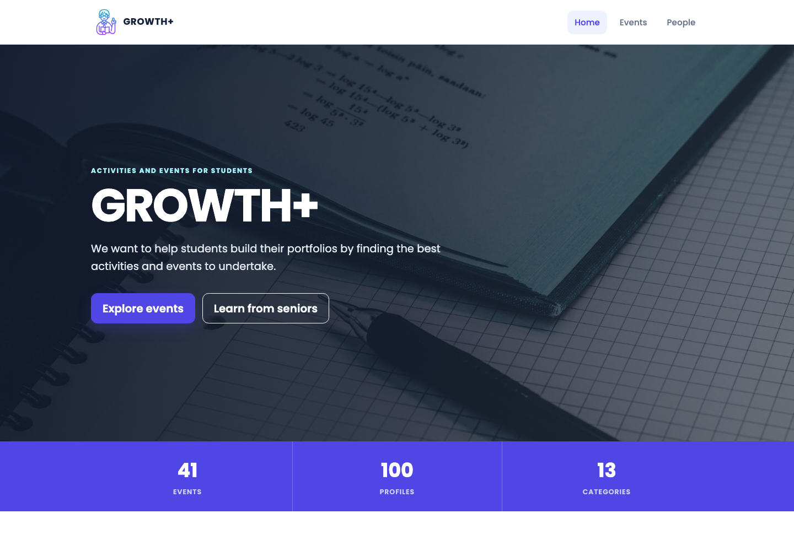
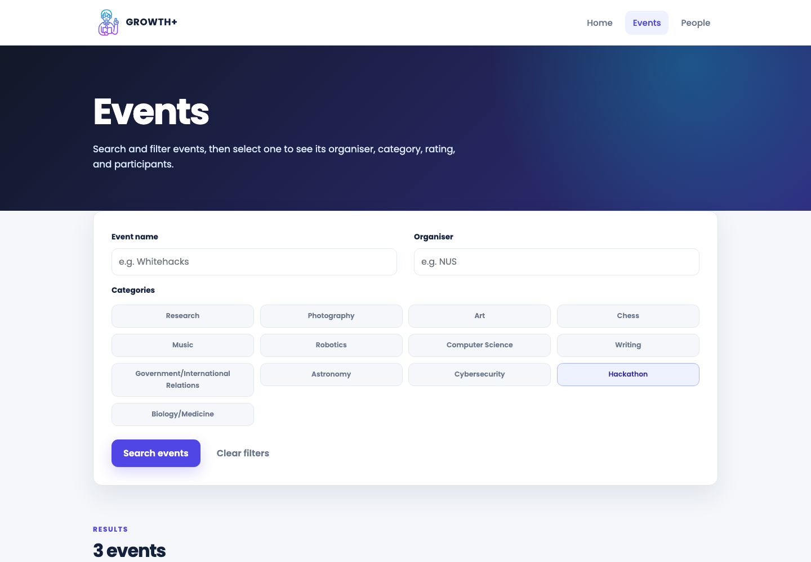
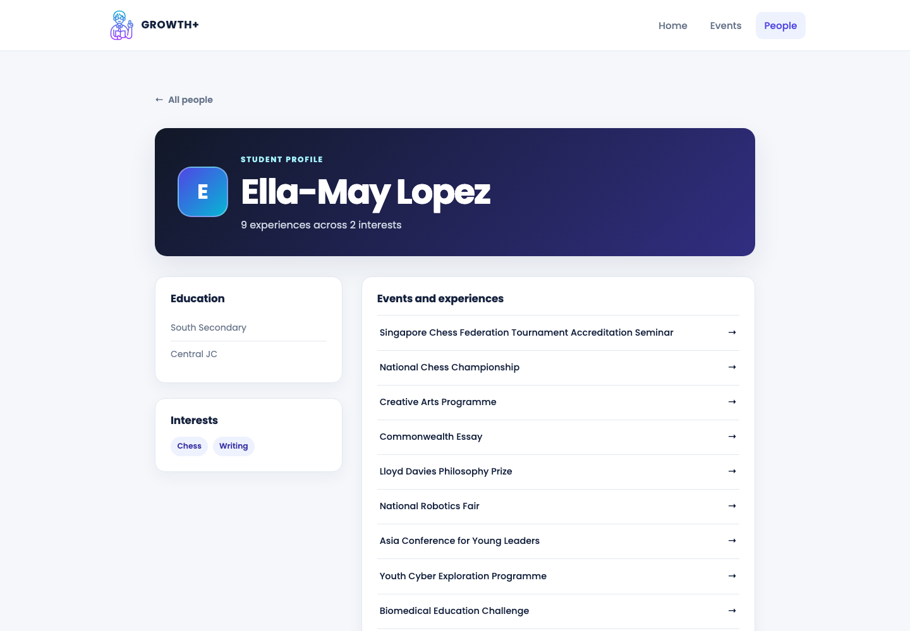
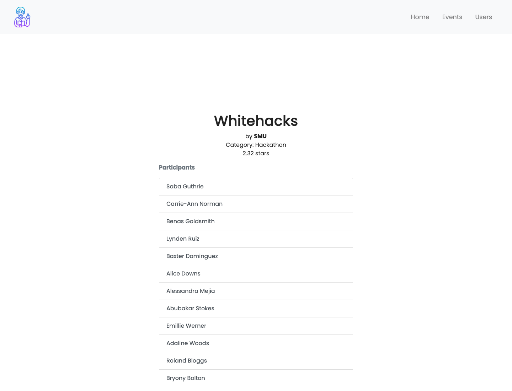

# GROWTH+

**Helping students find activities and events for their portfolios.**

GROWTH+ is a web app for pre-university students to find competitions, programmes, and extracurricular activities. Students can also look through other profiles to see which events their peers and seniors have joined.

The project was designed and built by a three-person student team during the 24-hour [iNTUition v8.0](https://intuition-v8.devpost.com/) hackathon in February 2022.



## What it does

- Browse academic, creative, technical, and leadership events.
- Search events by name or organiser and filter them by category.
- Search student profiles by name, school, and interests.
- Move between linked profiles and events.
- Use autocomplete when searching for schools, organisers, and events.

The demonstration data contains **41 events**, **100 student profiles**, and **13 interest categories**.



## Product views

| Student profile | Event details |
| --- | --- |
|  |  |

## How it works

Flask handles the routes and renders the Jinja templates. `JsonHandler` reads the event and profile data from JSON and applies the search filters. The templates link events to their participants and profiles to their events. JavaScript provides autocomplete on the search forms.

## Technology

- **Backend:** Python, Flask
- **Templating:** Jinja
- **Frontend:** HTML, CSS, JavaScript, Bootstrap 4
- **Data:** JSON
- **Collaboration:** Git and GitHub

## Run locally

1. Create and activate a virtual environment:

   ```bash
   python3 -m venv .venv
   source .venv/bin/activate
   ```

2. Install the dependency:

   ```bash
   pip install -r requirements.txt
   ```

3. Start the application:

   ```bash
   python server.py
   ```

4. Visit [http://127.0.0.1:5000](http://127.0.0.1:5000).

## Test

Run the automated route, search, and data-integrity checks with:

```bash
python -m unittest discover -s tests -v
```

## Project structure

```text
.
├── server.py          # Flask routes and application entry point
├── json_handler.py    # Search and data-access logic
├── events.json        # Demonstration event catalogue
├── profiles.json      # Demonstration student profiles
├── templates/         # Jinja page templates
├── static/            # Styles, JavaScript, and image assets
└── tests/             # Route, search, and data-integrity tests
```

## Built in 24 hours

We built GROWTH+ during the 24-hour hackathon. By the end, users could search and filter events and profiles, move between connected records, and use the site on both desktop and mobile screens.
